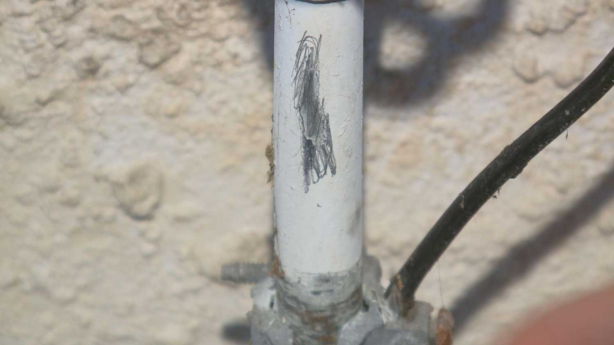
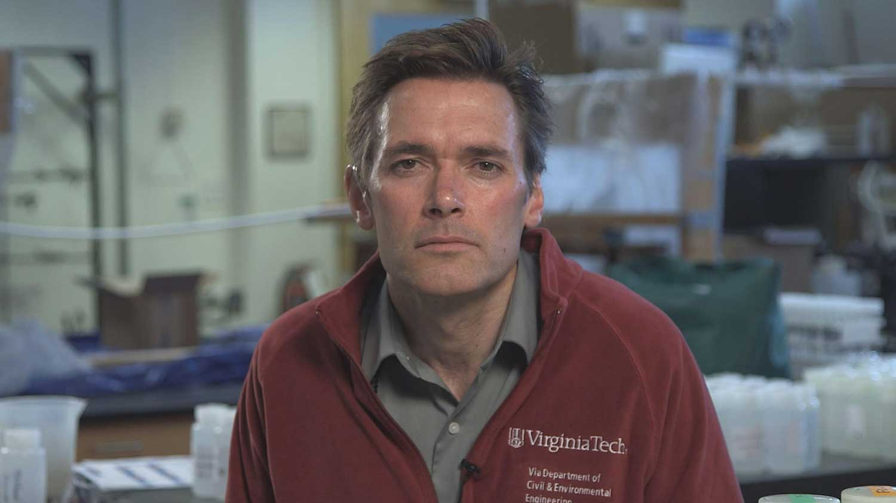
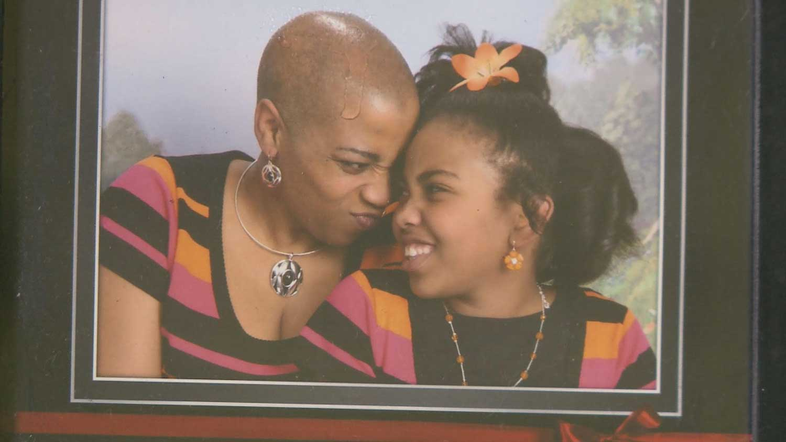
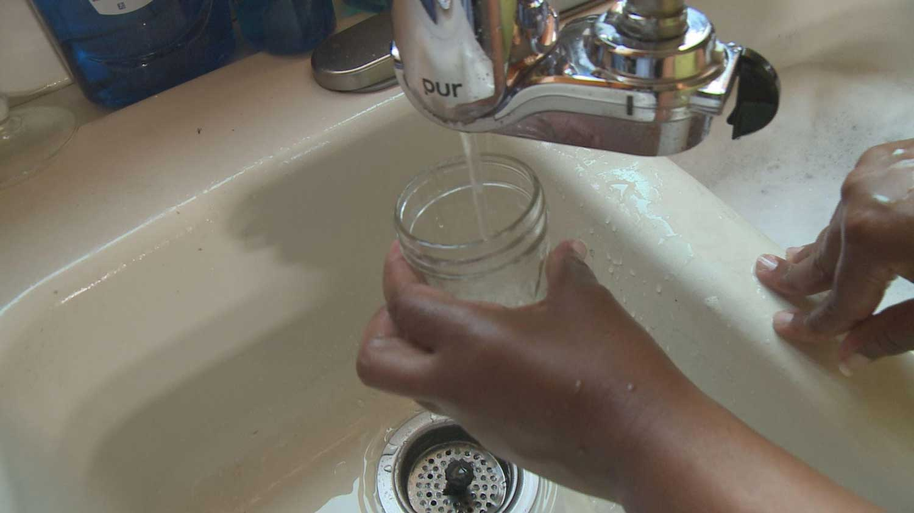





Neighborhoods on the city’s East and Lower West Sides [are “ground zero”](http://www.investigativepost.org/2016/05/03/lead-poisoning-much-worse-than-previously-disclosed/) for the worst lead poisoning problems in all of Upstate New York. Lead paint is considered the culprit, but the crisis in Flint, Michigan, has raised questions about the safety of the drinking water in cities like Buffalo.

The testing program used by Buffalo to determine whether drinking water is safe does not target the minority neighborhoods where the lead poisoning problem is concentrated, an analysis by Investigative Post has found.  

Instead, the city has focused on predominantly white neighborhoods in North and South Buffalo that report few, if any, lead poisoning cases.

Consider the disparity: The city collected only five of 300 samples in the past five rounds of testing from homes in the ZIP code located in the heart of the East Side.

By contrast, the city collected 41 out of the 300 samples from homes in the ZIP code that covers predominantly white neighborhoods in North Buffalo where not a single child was diagnosed with high lead levels in recent years.

Nevertheless, Mayor Byron Brown said he wasn’t alarmed by Investigative Post’s findings.

“I’m not concerned because our water is good in the City of Buffalo,” the mayor said.

<iframe class="wgrz" width="640" height="360" style="border-width:0" src="http://interactive.tegna-media.com/video/embed/embed.html?id=2337971&type=video&title=Disparity%20In%20Buffalo%20Tap%20Water%20Testing&site=71&playerid=6918249996581&dfpid=32805352&dfpposition=Video_prestream_external§ion=home" allowfullscreen webkitallowfullscreen mozallowfullscreen oallowfullscreen msallowfullscreen></iframe>

But Investigative Post found serious shortcomings in the city’s testing program that extend beyond the racial disparities and call into question the mayor’s claim that the city’s drinking water supply is safe.

Two national experts who helped bring to light the lead in drinking water crises in Flint and Washington, D.C., said Investigative Post’s findings are concerning. They are particularly troubled by the lack of testing in high-risk neighborhoods.

“If you’re not sampling in those neighborhoods, how do you know that the water is safe?” said [Marc Edwards, a civil engineering professor at Virginia Tech University](https://www.washingtonpost.com/news/inspired-life/wp/2016/01/26/meet-the-heroic-professor-who-helped-uncover-the-flint-lead-water-crisis/), who helped uncover the drinking water crisis in Flint last year and one in the nation's capital over a decade ago.

“I certainly would take the position that it is morally highly questionable, if not outright wrong,” added [Yanna Lambrinidou](http://www.ait.gr/ait_web_site/conference/olympiaethics/instructors.jsp), a Washington, D.C., activist who helped uncover that [city's lead in drinking water problems](http://cenblog.org/2009/01/lead-in-dc%E2%80%99s-drinking-water/) and served on a federal Environmental Protection Agency advisory panel that recommended revisions to the federal drinking water regulation that deals with lead.

In addition to the disparity in the sampling program, Investigative Post found:

* Buffalo’s program appears to be in violation of federal law for its failure to focus testing efforts on the houses considered most at risk.
* Up to a quarter of the homes sampled in 2014 belonged to current or former city employees or their family members. Many of these employees work for the water or public works departments.
* Buffalo has not acted on the federal recommendations to be transparent about the location of lead service lines, which are the chief source of lead in drinking water.
* The Erie County Health Department rarely tests drinking water for lead in homes where a child has been diagnosed with a high blood-lead level.

One community activist went so far as to accuse city and county officials of misleading residents.

“Basically, what I have found is that everybody from the county down to the local city system will lie out their rear-ends to not tell parents the truth that the water lines are lead,” said Carolette Meadows.

Oluwole McFoy, chairman of the [Buffalo Water Board](http://www.buffalowater.org/), acknowledged that there were “holes” in the sampling program that officials are trying to fix.

“We look at it as: it is not enough to do it the way we’ve been doing it,” he said.

### High lead poisoning rates

Buffalo has the biggest lead poisoning problem in Upstate, with hundreds of children diagnosed each year in black and Hispanic neighborhoods in the East and lower West Sides. The [problem dates back years](http://www.investigativepost.org/?s=lead+poisoning&submit.x=0&submit.y=0&submit=Go): inner-city neighborhoods accounted for three of the four upstate ZIP codes reporting the most new lead poisoning cases for a three-year period ending in 2012.

<!-- scratches  -->

A lead service line entering a home in Buffalo's East Side.

“Buffalo is ground zero in the entire country for lead poisoning,” said David Hahn-Baker, a local environmental activist who has studied the lead problem for three decades.

A child diagnosed with high blood-lead levels can suffer irreversible harm, such as a lowered IQ and developmental delays. In fact, the Centers for Disease Control and Prevention has determined there is no safe blood lead level in children.

Lead paint in Buffalo’s old housing stock is cited as the chief culprit. But the crisis in Flint, where dangerous levels of lead were found in drinking water in February 2015, has raised serious questions about water quality in cities like Buffalo that have older infrastructure.

Buffalo’s aging drinking water infrastructure is part of a growing problem across New York. The estimated cost of repairing and updating the state’s drinking water systems is almost $40 billion.

Houses in Buffalo built before 1940 are more likely to have a lead service line that carry water from the street into the house. Experts say these homes are most at-risk for having lead in their drinking water.

“It’s like drinking water through a 30-foot lead straw,” said Edwards, the national expert.

Homes built between 1983 and 1987 are more likely to have plumbing inside that contains lead – such as in solder used to connect pipes.



Like all water utilities, Buffalo’s is required by [federal law](https://www.epa.gov/dwreginfo/lead-and-copper-rule) to periodically test drinking water in a limited number of homes. All the homes tested are required to have some form of lead in the pipes. In Buffalo, an average of 60 homes are sampled every three years.

Experts say water utilities and health departments tend to downplay the risks of lead in drinking water.

“I guarantee you: you sample for lead in worst-case Buffalo homes, you’re going to find significant levels of lead,” Edwards said.

### The disparity

Investigative Post filed Freedom of Information Law requests to obtain records for the sampling conducted in 2002, 2005, 2008, 2011 and 2014.

An analysis of the records found that only one-third of the samples the city collected came from homes in the five ZIP codes that account for 91 percent of the reported childhood lead poisoning cases. These neighborhoods are collectively 66 percent minority.

Nothing illustrates this disparity more than the sampling in ZIP code 14211, an area of the city bisected by Genesee Street that includes neighborhoods by Martin Luther King and Schiller parks. The neighborhoods here are collectively 83 percent minority and accounted for almost 20 percent of the children diagnosed with dangerous levels of lead in their blood over the past three years. That’s 118 children.

Nonetheless, not a single home here was sampled in 2014 or in 2008.

In contrast, 46 percent of the samples the city collected came from homes in five ZIP codes that account for only 2.5 percent of the reported childhood lead poisoning cases. These neighborhoods are 84 percent white.

The two most tested ZIP codes — 81 of 300 samples — were in North and South Buffalo where not a single child was found to have elevated blood levels in the past three years. Both neighborhoods are overwhelmingly white.



East Side residents interviewed by Investigative Post said they are disappointed, but not surprised, by the disparity. Residents say the disparity in testing is part of a larger pattern of neglect by the city.

“People in these communities are numb to it,” said Madi Robinson, of East Woodside Avenue on the East Side.

“You don’t know what we’ve been through down here. How do you get them to act?”  

Robinson’s neighbor, Alexis Adams, said the disparity in the sampling program made her “a little frustrated, a little angry and a lot curious.”

“We’ve got some of the older houses in the city, it’s proven that they’ve got higher lead levels. So, why wouldn’t they take the time to check it out?” she said.

East Side resident Alexis Adams said the disparity in Buffalo's sampling program made her “a little frustrated, a little angry and a lot curious.”

Brown said any resident can volunteer to participate in the city’s sampling program and reminders are inserted in ratepayers’ bills before testing begins.

“We’re not ignoring any neighborhood,” he said. “They have the ability to contact us and request that their water be tested.”

Neither Meadows nor Robinson recall seeing the insert in their water bills. Adams only noticed the insert after a reporter asked her to check her most recent bills.

“It is a little flier with a pretty picture of a boat floating on the lake,” Adams said. “I didn’t pay attention to it.”

McFoy, the Buffalo Water Board chairman, acknowledged that the fliers do not reach tenants whose landlords pay the bills.

“We know we have significant renters so we’ve had to change our tactics up and actually go door to door in those neighborhoods,” he said.

### Possible violation of law

Federal law requires that at least half the homes sampled are deemed most at-risk. Investigative Post obtained, through the Freedom of Information Law, the records the city said it used to determine the most at-risk homes and the location of lead service lines. The law requires every home sampled have lead plumbing and at least half must have lead service lines that run from the street into homes, which are “pure 100 percent lead,” said Edwards, the Virginia Tech professor.

<!-- side by side image/video -->

  

    
  

  

    

&nbsp;

  

  

A dirty (left) and clean filter from Carolette Meadows' water filter system in her basement. The video shows the first draw of her water after she removes the filter. The water is cloudy with unknown floating white and rust-colored particles.

<!-- row -->

Of the 62 homes sampled in 2014, Investigative Post could only verify lead service lines in 28 households based on the records the city provided.

Furthermore, many of the records the city provided are from a century ago, some of which could be inaccurate. For example, most of the records do not indicate if a lead service line had been replaced.

“We ran into this in Flint, Michigan, where we’re learning that the error rate in these records is about 50 percent,” Edwards said.

<iframe class="wgrz" width="640" height="360" style="border-width:0" src="http://interactive.tegna-media.com/video/embed/embed.html?id=2339173&type=video&title=Erie%20Co.%20Health%20Dept.%20Rarely%20Test%20Tap%20Water&site=71&playerid=6918249996581&dfpid=32805352&dfpposition=Video_prestream_external§ion=home" allowfullscreen webkitallowfullscreen mozallowfullscreen oallowfullscreen msallowfullscreen></iframe>

“So, how do you know if you’re meeting the law when the records may not have been updated? I mean, it’s hard to believe that in some of those homes the service line hasn’t been replaced in a hundred years.”

The [Erie County Health Department](http://www2.erie.gov/health/) said the city needs to ensure it is sampling the most at risk homes.

“We have required them to investigate current plumbing materials and update their monitoring plan,” a health department spokeswoman said in an Aug. 17 email.

### Possible conflict of interest

Investigative Post also found up to a quarter of the homes tested in 2014 were owned by current and former city employees or their family members.

Among the homes the city sampled that year are those owned by a former chief pumping plant engineer employed by the city for 30 years, a water treatment supervisor employed for 28 years and a chemist employed for 23 years.

<iframe class="wgrz" width="640" height="360" style="border-width:0" src="http://interactive.tegna-media.com/video/embed/embed.html?id=2337887&type=video&title=Experts%20Critical%20Of%20Buffalo%20Tap%20Water%20Testing&site=71&playerid=6918249996581&dfpid=32805352&dfpposition=Video_prestream_external§ion=home" allowfullscreen webkitallowfullscreen mozallowfullscreen oallowfullscreen msallowfullscreen></iframe>

In addition, the city sampled homes owned by public works employees, a parking enforcement officer and a senior engineer. In 2008 and 2011, the city sampled a home owned by state [Assemblywoman Crystal Peoples-Stokes](http://assembly.state.ny.us/mem/Crystal-D-Peoples-Stokes).

Experts said that while testing homes owned by current and former employees, family members and politicians is not illegal, it does raise questions about whether the city is testing the most at-risk homes.

“It seems like they’re sampling more for convenience rather than for really trying to find lead problems and protect public health,” Edwards said.

“Sampling homes of employees, I don’t know what justification you’d have for claiming that those are the worst-case homes in the city.”

Marc Edwards, Virginia Tech University professor.

Lambrinidou, the D.C. expert, said testing the homes of current and former government employees poses a conflict of interest.

“It is time for water utilities to be required to monitor precisely in the highest-risk neighborhoods where people do not have the means to protect themselves,” she said.

Brown disagreed with the experts’ contention that sampling the homes of current and former employees poses a conflict.

“If they request that their water be tested there’s no problem with them making that request just as we would encourage any city resident,” he said.

### Inaction and ‘cheating’

Investigative Post found other problems with the testing program.

In February, the EPA directed all water utilities to “increase transparency” by posting on their public websites the locations of lead service lines and updated records on the types of plumbing inside homes. Buffalo has failed to follow this guidance.

“If utilities are not able to demonstrate that they have made progress in this regard, then we have a serious problem on our hands,”  Lambrinidou said.

Buffalo used all three "cheats" in its water sampling program.

In June, [The Guardian](https://www.theguardian.com/environment/2016/jun/02/lead-water-testing-cheats-chicago-boston-philadelphia) newspaper found that at least 33 cities, including Buffalo, used “cheats” that could reduce the amount of lead in drinking water before sampling.

In fact, Buffalo’s water utility was one of a handful that “cheated” on all three measures by instructing residents to:

* Flush faucets prior to testing, which removes water that may have been in contact with lead plumbing.
* Clean filter screens inside faucets, which can remove flakes of lead.
* Run the water slowly while collecting samples, which can prevent lead particles from flaking off pipes.

“I don’t know how this sounds to residents of Buffalo who are asked and expected to trust their water utility when the utility tells them that their water is safe to drink,” Lambrinidou said.

City officials have since changed the sampling instructions so that they are more in line with EPA’s guidance.

But the Erie County Health Department has no plans to change its protocols when investigating sources of lead in homes where a child is diagnosed with elevated blood-lead levels.

### Health Department ignores risk

Alexis Adams, the East Side resident, said her great-grandson was diagnosed with a high blood-lead level two years ago. She said county health inspectors checked the window sills and walls, but did not find any lead hazards.

What did the county health department conclude?

Carolette Meadows and her daughter in a family photo.

“They said primarily they think he was putting pennies in his mouth, coins in his mouth,” she said. “That’s the best they could come up with.”

“They didn’t check the water,” she added.

Meadows, the Buffalo activist, had a similar experience after her daughter was diagnosed with an elevated blood lead level. The only difference was that the health department said her daughter’s exposure came from the soil.

Although soil can be a source of lead exposure, Meadows said her daughter rarely played in the yard.

“They never tested the water,” she said.

“I didn’t know any better at the time. I just had a suspicion that they were not telling me the truth.”

Commissioner of Health Gale Burstein refused an interview request. She said in a prepared statement that the county does not routinely test the water in the houses of children diagnosed with elevated lead levels in their blood.

Carolette Meadows uses a tap filter to remove lead from her water.

In her statement, Burstein said county inspectors have identified lead paint “as the primary source of lead in our investigation of elevated blood lead levels.”

“If presented with evidence that tap water was becoming an identified source of lead poisoning, ECDOH would absolutely consider modification of our testing protocol to include tap water,” she said.

Edwards called Burstein’s reasoning “narrow minded,” and Lambrinidou said it was  “unconscionable.”

“It is unethical and it is entirely unscientific,” said Lambrinidou.

“Anybody, and certainly public health professionals who take the time to understand how lead in drinking water works, would know better than to make blanket statements like this that reveal a lack of understanding.”

### Residents skeptical

McFoy, chairman of the Buffalo Water Board, said the city has moved up its sampling program a year ahead of schedule as a result of “heightened awareness” since the crisis in Flint.

Investigative Post is hosting a summit on lead poisoning Nov. 16 featuring reporter Dan Telvock and national experts. <a href="http://investigativepost.org/events/"><strong>Click here for details</strong></a>.

He said the city has more than doubled the number of homes it is testing this round to “ensure that we have complete coverage in the city.” McFoy said officials have visited block clubs, called on Common Council members to help recruit residents and gone door to door in undersampled neighborhoods.

“We want to simply ensure that we have complete coverage in the city,” McFoy said.

East Side residents said they are not hopeful that testing will increase in their neighborhoods.

“Of course it upsets me that we are obviously neglected,” Robinson said. “They don’t do anything down here unless there’s an urgency to act.”

Adams said she felt similarly.

“I would ask them why they’re not representing us, why they’re not looking out for our best interests,” she said.



Share this report:

<!-- Go to www.addthis.com/dashboard to customize your tools -->

Help us grow our nonprofit newsroom with a tax-deductible contribution. <a href="https://www.investigativepost.org/donate/"><strong>Donate Now</strong></a>.

